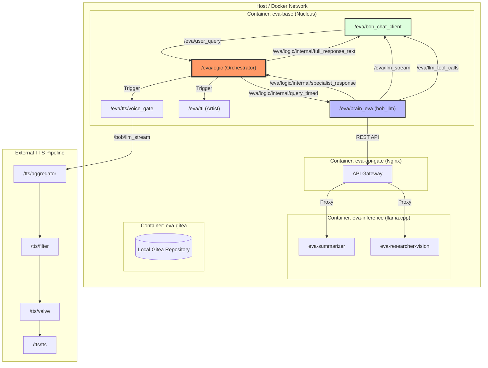

# ROS Package [bob_central](https://github.com/bob-ros2/bob_central)
[](https://github.com/bob-ros2/bob_central/actions/workflows/ros2_ci.yml)
[](https://opensource.org/licenses/Apache-2.0)

This package is a **General Central Orchestration Brain-Mesh System** designed for building and hosting self-evolving, autonomous AI entities within isolated container environments. It represents an AI deeply integrated into a **ROS 2 environment**, leveraging the full power of the ROS 2 ecosystem (topics, services, and parameters) for real-world interaction and self-monitoring.

While it utilizes various components from the `bob-ros2` ecosystem, it serves as a standalone foundation for any complex AI project requiring a multi-agent, modular orchestration layer.

## The Purpose: An AI Nucleus
`bob_central` is intended to be used as a core "nucleus" for AI projects. It is designed to be cloned and expanded, providing a stable, secure, and inspectable environment where humans and coding agents can collaborate to build something greater. 

Whether used as a standalone autonomous brain or integrated into a larger robotic context, it provides the essential orchestration needed for high-level reasoning and self-evolution.

## Core Concept
At its heart, `bob_central` manages a "Brain-Mesh" of interconnected specialized nodes (e.g., Vision, Researcher, Coder). The system is not monolithic; it is a distributed network of intelligence where every component is replaceable and extensible.

The system handles:
* **Autonomous Intent Routing**: Analyzing input and dispatching tasks to specialized specialist agents.
* **Environmental Awareness**: Injecting real-time context and system state into the reasoning process via ROS parameters and topics.
* **Self-Modification Ready**: Modular Anthropic-style skills allow the AI (in collaboration with a human or agent) to dynamically expand its own toolkit.

## Architecture & Docker
`bob_central` is strictly **Docker-First**, emphasizing security, absolute process isolation, and portability.

### Container Ecosystem & Network
* **`api-gateway` (Nginx)**: Secure entry point that proxies LLM traffic and injects runtime authentication.
* **`eva-base`**: The core execution environment for orchestration, logic, and self-evolution modules.
* **`eva-summarizer`**: Focused inference layer for logic and voice-gate summarization (optimized on Qwen-14B).
* **`eva-memory` (Qdrant)**: High-performance Vector Database for semantic search and long-term embedding storage.
* **Network Isolation**: All internal communication happens over a dedicated Docker bridge network (`eva-net`).

### Security Features
* **Credential Isolation**: Pure separation of code and secrets.
* **`/tmp/eva` Sandbox**: All temporary files and generated assets are locked into a dedicated host volume, preventing unauthorized filesystem access.

## System Architecture

The following diagram illustrates the interaction between the Docker containers and the internal ROS 2 communication mesh within the Nucleus:



## ROS 2 API
### Nodes & Topics
| Topic | Type | Description |
|-------|-------|-------------|
| `/eva/user_query` | `std_msgs/String` | Universal input channel for user queries. |
| `/eva/user_response` | `std_msgs/String` | Final bundled response (with metadata). |
| `/eva/llm_stream` | `std_msgs/String` | Real-time token stream for low-latency interfaces. |
| `/eva/artist/prompt` | `std_msgs/String` | Intent channel for visual generation. |

### Parameters
* `api_url`: The gateway endpoint for LLM interactions.
* `system_prompt_file`: Defines the core identity and logic of the orchestrator.
* `skill_dir`: Directory for modular, self-contained skill specifications.

## Getting Started
### Interactive Shell
You can enter a direct dialogue with the brain's core via the `bob_llm` chat interface:
```bash
ros2 run bob_llm chat --topic_in "/eva/user_query" --topic_out "/eva/llm_stream"
```

### Launching the Core
```bash
ros2 launch bob_central orch_eva.yaml
```

## Development & Evolution
* **Linter Compliant**: Built with `ament_lint_auto` to ensure high code quality.
* **Extensible Architecture**: Designed for users who want to clone a "living" system and evolve it using their own coding agents.
