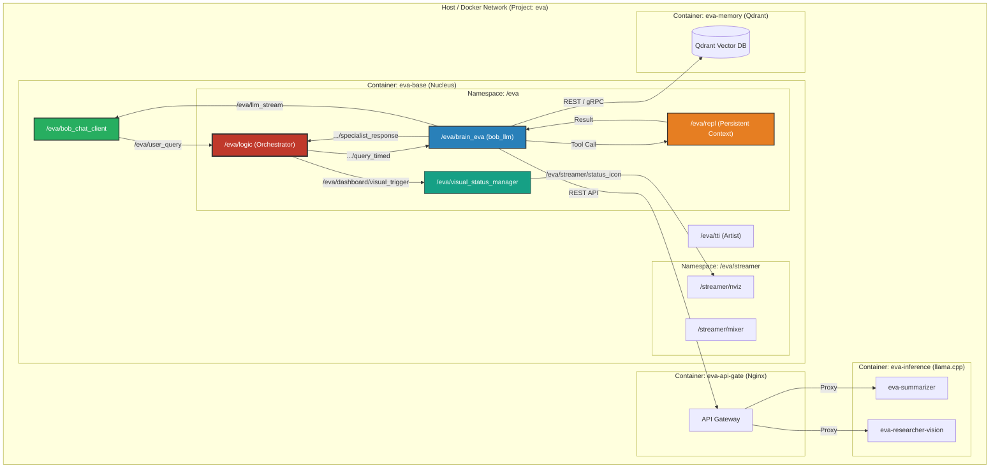

# ROS Package [bob_central](https://github.com/bob-ros2/bob_central)
[](https://github.com/bob-ros2/bob_central/actions/workflows/ros2_ci.yml)
[](https://opensource.org/licenses/Apache-2.0)

This package is a **General Central Orchestration Brain-Mesh System** designed for building and hosting self-evolving, autonomous AI entities within isolated container environments. It represents an AI deeply integrated into a **ROS 2 environment**, leveraging the full power of the ROS 2 ecosystem (topics, services, and parameters) for real-world interaction and self-monitoring.
# bob_central (v0.5.0)

**The Central Nervous System of the Bob ROS Ecosystem.**

`bob_central` provides the essential infrastructure for orchestrating complex, multi-modular AI agents in a ROS 2 environment. It handles everything from high-level decision making (Orchestrator) to real-time system visualization (nviz), stateful code engineering (REPL), and autonomous documentation management (Knowledge Graph).

## Core Concept
At its heart, `bob_central` manages a "Brain-Mesh" of interconnected specialized nodes. The system is not monolithic; it is a distributed network of intelligence where every component is replaceable and extensible.

## Key Features
- **Recursive Reasoning (RLM Core)**: Multi-step internal dialogue using expert personas (Architect, Critic, Planner, Debugger) to decompose complex tasks.
- **Persistent Python REPL**: A stateful engineering environment for iterative code development and system manipulation, preserving state across sessions.
- **Centralized Orchestration**: A powerful node that manages conversation flows, busy-locking, and tool calls.
- **Visual Telemetry (nviz)**: High-performance, event-driven dashboard rendering (8-bit grayscale bitmaps) with real-time status indicators.
- **Autonomous Knowledge Graph**: On-demand technical documentation fetching and indexing for AI context.
- **Self-Evolution Framework**: Pure ROS 2 native infrastructure for agents to modify and expand their own capabilities.

## Recursive Thought (RLM)
Version 0.5.0 introduces the **Recursive Language Model** core. Eva can now use the `perform_thought` tool to consult internal specialists before executing sensitive actions. This enables high-level planning and risk assessment within the same conversational turn.

## Persistent Engineering (REPL)
The `repl_kernel` skill provides Eva with a permanent engineering workspace. 
*   **Persistent State**: Variables, imports, and function definitions persist as long as the stack is running.
*   **Safety**: Isolated execution via a dedicated `repl_node` with 15s timeouts and capture of all stdout/stderr output.

## Ecosystem Management
### The Docker Ecosystem
To manage the complex set of services, a master management script is provided in the `docker/` directory.

**Quick Management:**
```bash
./docker/manage.sh up      # Start the entire ecosystem
./docker/manage.sh down    # Stop all services
./docker/manage.sh build   # Rebuild local images
```

#### Compose Stacks
| File | Description |
|:---|:---|
| `compose-base.yaml` | Core logic (`eva-base`) and API Gateway (`eva-api-gate`). |
| `compose-nviz.yaml` | Visual dashboard streamer (`eva-nviz-streamer`). |
| `compose-tti.yaml` | Image generation engine (`eva-artist`). |
| `compose-gitea.yaml` | Local Git infrastructure and CI runner. |
| `compose-inference.yaml` | LLM inference servers (Summarizer & Vision). |
| `compose-qdrant.yaml` | Vector database for long-term memory. |

### Security Features
* **Credential Isolation**: Pure separation of code and secrets via environment variables.
* **`/root/eva` Sandbox**: All temporary files and generated assets are locked into a dedicated host volume.

## System Architecture

The following diagram illustrates the interaction between the Docker containers and the internal ROS 2 communication mesh:



## ROS 2 API
### Nodes & Topics
| Topic | Type | Description |
|-------|-------|-------------|
| `/eva/user_query` | `std_msgs/String` | Universal input channel for user queries. |
| `/eva/repl/input` | `std_msgs/String` | Raw Python code feed for the persistent REPL node. |
| `/eva/repl/output` | `std_msgs/String` | Captured output from the engineering workspace. |
| `/eva/dashboard/visual_trigger` | `std_msgs/String` | Internal status triggers (busy/idle/thinking) for UI. |
| `/eva/llm_stream` | `std_msgs/String` | Real-time token stream for low-latency interfaces. |

## Development & Evolution
* **Linter Compliant**: 100% compliance with `ament_lint_auto`, `flake8`, and `pep257`.
* **Standardized Skills**: All tools are documented via `SKILL.md` using the Anthropic Agent Skill standard.
* **Extensible Architecture**: Designed for autonomous self-evolution.
