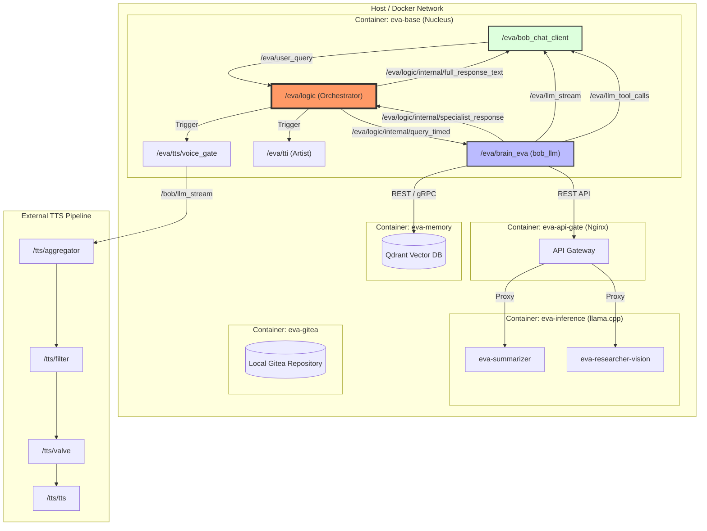

# Eva System Architecture

This diagram visualizes the interaction between the Docker containers and the ROS 2 nodes within the Nucleus.

```mermaid
graph TD
    subgraph "Host / Docker Network"
        subgraph "Container: eva-api-gate (Nginx)"
            GATE[API Gateway]
        end

        subgraph "Container: eva-inference (llama.cpp)"
            SUM[eva-summarizer]
            VIS[eva-researcher-vision]
        end

        subgraph "Container: eva-base (Nucleus)"
            direction TB
            CLIENT["/eva/bob_chat_client"]
            LOGIC["/eva/logic (Orchestrator)"]
            BRAIN["/eva/brain_eva (bob_llm)"]
            TTI["/eva/tti (Artist)"]
            VGATE["/eva/tts/voice_gate"]
        end

        subgraph "Container: eva-gitea"
            GITEA[(Local Gitea Repository)]
        end

        subgraph "Container: eva-memory"
            QDRANT[(Qdrant Vector DB)]
        end
    end

    %% Communication Flow
    CLIENT -- "/eva/user_query" --> LOGIC
    LOGIC -- "/eva/logic/internal/query_timed" --> BRAIN
    BRAIN -- "/eva/logic/internal/specialist_response" --> LOGIC
    BRAIN -- "/eva/llm_stream" --> CLIENT
    BRAIN -- "/eva/llm_tool_calls" --> CLIENT
    LOGIC -- "/eva/logic/internal/full_response_text" --> CLIENT
    
    %% Memory Access
    BRAIN -- "REST / gRPC" --> QDRANT
    
    %% Specialist Actions
    LOGIC -- "Trigger" --> TTI
    LOGIC -- "Trigger" --> VGATE
    
    %% External / TTS Block
    subgraph "External TTS Pipeline"
        VGATE -- "/bob/llm_stream" --> AGG["/tts/aggregator"]
        AGG --> FILT["/tts/filter"]
        FILT --> VAL["/tts/valve"]
        VAL --> TTS["/tts/tts"]
    end

    %% Inference Links
    GATE -- "Proxy" --> SUM
    GATE -- "Proxy" --> VIS
    BRAIN -- "REST API" --> GATE
    
    %% Style
    style LOGIC fill:#f96,stroke:#333,stroke-width:4px
    style BRAIN fill:#bbf,stroke:#333,stroke-width:2px
    style CLIENT fill:#dfd,stroke:#333,stroke-width:2px
```
